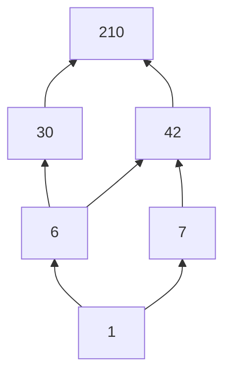

# Brutus–Pell Rank Lattice

The Rank Lattice organizes verified Square-Rank Fibers by the divisibility of their roots.

If

$$z_P(n)=C^2,$$

then the lattice node is the root $C$, not the full rank $C^2$.

## Verified seed roots

The current Atlas contains verified square-rank roots

$$\boxed{6,\ 7,\ 30,\ 42,\ 210}.$$

To obtain a genuine lattice under meet = gcd and join = lcm, closure adds the identity node

$$\boxed{1}$$

and the engine independently verifies

$$z_P(1)=1=1^2.$$

Thus the current closed node set is

$$\boxed{\{1,6,7,30,42,210\}}.$$
## Hasse diagram



The arrows mean divisibility covers inside the current closed set.

## Important joins

$$6\vee7=\operatorname{lcm}(6,7)=42,$$

$$7\vee30=\operatorname{lcm}(7,30)=210,$$

$$30\vee42=\operatorname{lcm}(30,42)=210.$$

Corresponding Square-Rank levels are:

$$6^2=36,\quad7^2=49,\quad30^2=900,\quad42^2=1764,\quad210^2=44100.$$

## Important meet

One reason the identity node is required is

$$7\wedge30=\gcd(7,30)=1.$$

Without node 1, the observed roots would form a join-semilattice fragment, but not a lattice in the strict order-theoretic sense.
## Fiber attachment

Each node may carry one or more verified Atlas inputs:

- root 6 / rank 36: includes 73;
- root 7 / rank 49: includes 293;
- root 30 / rank 900: includes 10877;
- root 42 / rank 1764: includes 3529, 9261, 21389, 1203930;
- root 210 / rank 44100: includes the verified 13/31 mirror-host states.

## Reproduce

```bash
python -m calculation.rank_lattice
```

The machine-readable structure is written to `reports/rank_lattice.json`.

## Scientific boundary

The divisibility lattice on positive integers with meet = gcd and join = lcm is standard mathematics.

`Brutus–Pell Rank Lattice` is the project name for attaching the Atlas' verified Square-Rank Fibers and relations to this structure. The project name is not a claim that lattice theory itself is new.

Static diagram: `figures/rank-lattice.svg`.
